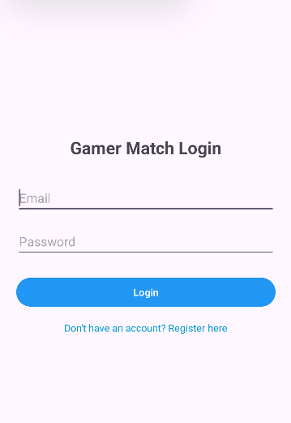
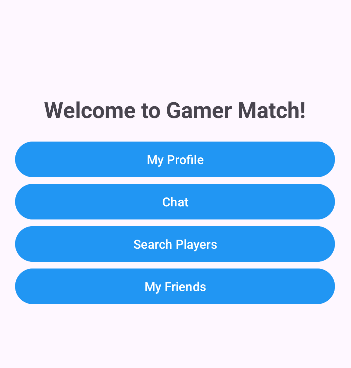
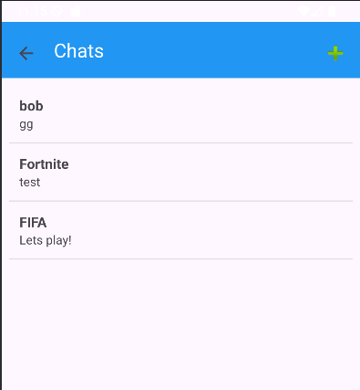

# 🎮 GamerMatch
**Find your perfect squad. Connect, Chat, and Play.**

GamerMatch is a social Android application designed for gamers to find teammates based on shared interests, engage in real-time discussions, and build lasting gaming friendships. This project was developed as part of the final year B.Sc. in Computer Science.

---

## 📸 App Preview

|              Login              |             Main              |               Inbox                | Search | Profile |
|:-------------------------------:|:-----------------------------:|:----------------------------------:| :---: | :---: |
|  | |     |  |  |

---

## 🚀 Key Features
* **Player Discovery**: Search for teammates based on specific game titles using specialized Firestore queries.
* **Real-time Chat**: Private messaging and game-specific group chats with live synchronization.
* **Localized Experience**: Full support for English and Hebrew (RTL) devices.
* **Dynamic Profile**: Manage favorite games and player identity with persistent cloud storage.

---

## 🏗 Technical Stack
* **Language**: Java
* **Database**: Firebase Cloud Firestore
* **Authentication**: Firebase Auth
* **Architecture**: Model-View-ViewHolder (MVVM) with a focus on asynchronous data handling.

---

## 👥 Team & Contributions
Developed by a team of three Computer Science students.

### Students
--Michael Tsegaye

--Roi Baly

--Lotem Kimchi
