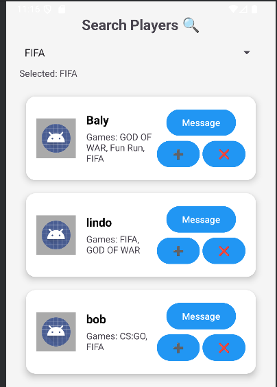
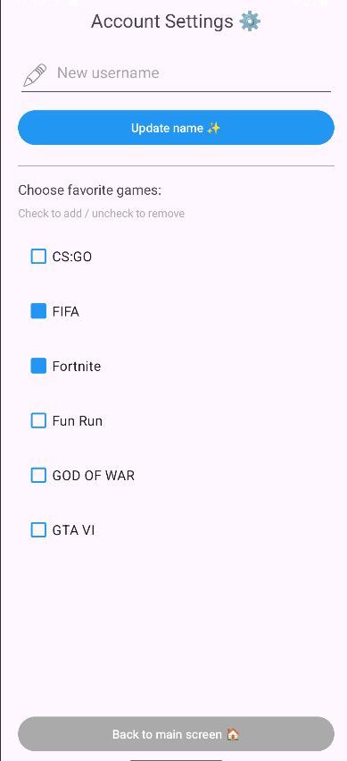

# 🎮 GamerMatch
**Find your perfect squad. Connect, Chat, and Play.**

GamerMatch is a social Android application designed for gamers to find teammates based on shared interests, engage in real-time discussions, and build lasting gaming friendships. This project was developed as part of the final year B.Sc. in Computer Science.

---

## 📸 App Preview

| Inbox | Search | Profile |
| :---: | :---: | :---: |
|  |  |  |

---

## 🚀 Key Features
* **Player Discovery**: Search for teammates based on specific game titles using specialized Firestore queries.
* **Real-time Chat**: Private messaging and game-specific group chats with live synchronization.
* **Localized Experience**: Full support for English and Hebrew (RTL) devices.
* **Dynamic Profile**: Manage favorite games and player identity with persistent cloud storage.

---

## 🛠 Technical Challenges & Solutions
* **Real-time Synchronization**: Transitioned from one-time data fetches to `addSnapshotListener` in `InboxActivity` to ensure chat lists update immediately upon returning to the screen.
* **Data Stability**: Resolved `StringIndexOutOfBoundsException` by implementing length-safety checks in the `InboxAdapter` to handle short messages safely.
* **Atomic Registration**: Fixed `NOT_FOUND` errors by ensuring user documents are created using `.set()` during registration before any `update()` calls are allowed in Account Settings.
* **Query Optimization**: Implemented Composite Indexes in Firebase to support complex filtered searches and ordered chat lists.

---

## 🏗 Technical Stack
* **Language**: Java
* **Database**: Firebase Cloud Firestore
* **Authentication**: Firebase Auth
* **Architecture**: Model-View-ViewHolder (MVVM) with a focus on asynchronous data handling.

---

## 👥 Team & Contributions
Developed by a team of three Computer Science students. My primary contributions included:
* Developing the real-time **Chat and Inbox system**.
* Implementing **Localization** across the entire UI for HE/EN support.
* Managing the **Firebase integration** and database security rules.