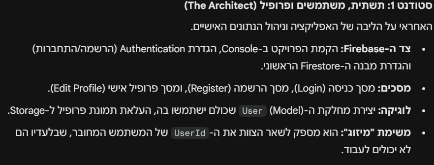

# GamerMatch - Core Infrastructure & Gamer Profile System 🎮

This project provides the foundational architecture for the **GamerMatch** application. As **The Architect**, I have established the core engine for user authentication, data persistence, and player matchmaking, ensuring a stable environment for the next stages of development.

## 🛠 Features Implemented (The First Student Scope)

* **Firebase Core Setup**: Full integration with Firebase Authentication and Cloud Firestore for real-time data management.
* **Minimalist User Model**: A high-performance `User` class containing essential data: `m_Name`, `m_Email`, `m_FavoriteGames`, and `m_FriendsList`.
* **Authentication Engine**: Secure Login and Registration flows with server-side account creation.
* **Gamer Profile Management**: Interface for users to update their identity and manage their favorite games list—the primary data source for matchmaking.
* **Navigation & UX**: Stable activity-based navigation using **Intents** and a "Return to Main" safety feature to prevent app crashes.


## 🚀 Integration Guide (For Team Members)

To maintain consistency and ensure the app functions as a unified system, please follow these guidelines:

### 1. Identifying the Current User
To link your chats or search results to the current user, use the helper:
```java
FireBaseHelper helper = new FireBaseHelper();
String currentUserId = helper.GetCurrentUserId(); // Provides the unique ID
```
All data you create (chats, groups, or friends) must be linked to the logged-in user. Use the centralized helper to retrieve the unique `UserID` of the person currently using the app.

### 2. Matchmaking & Search Logic
The infrastructure for the search engine is already in place. You can query the database to find players based on the games they have added to their profiles.

### 3. Navigation Standards
To ensure stability, do not use the `NavController` for moving between my activities. Use **Intents** for navigation and call `finish()` when returning to the main screen to keep the back-stack clean.


## 📋 Coding Standards (Strict Compliance)
* **Tabs Only**: Use Tabs (not spaces) for all indentation.
* **Variable Prefixes**: Use `m_` for class members and `i_` for parameters.
* **Braces**: Every `if`, `else`, and loop must be wrapped in `{ }` braces.
* **Language Support**: The UI is designed to support Hebrew with Right-to-Left (RTL) compatibility.

# Key Responsibilty:

---
**Developed by Michael**
